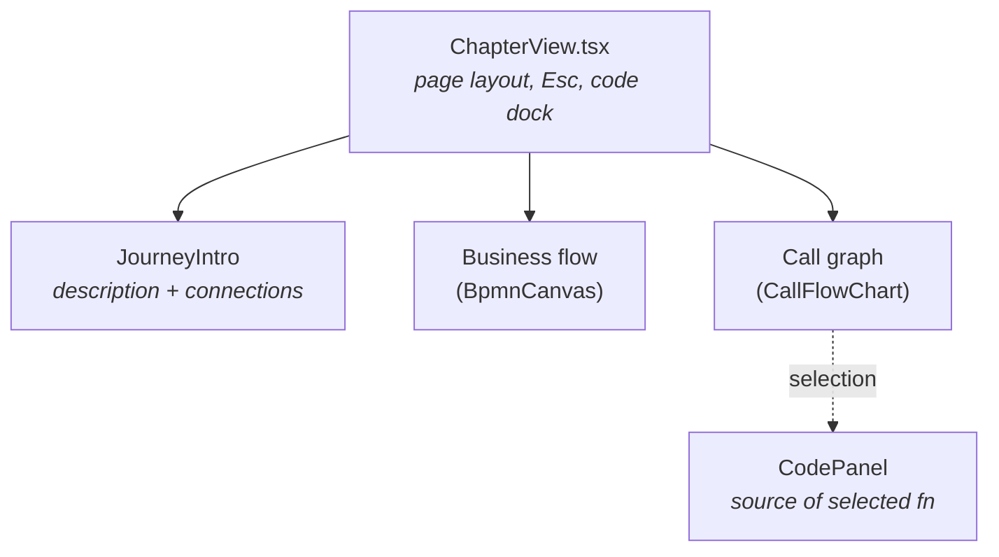
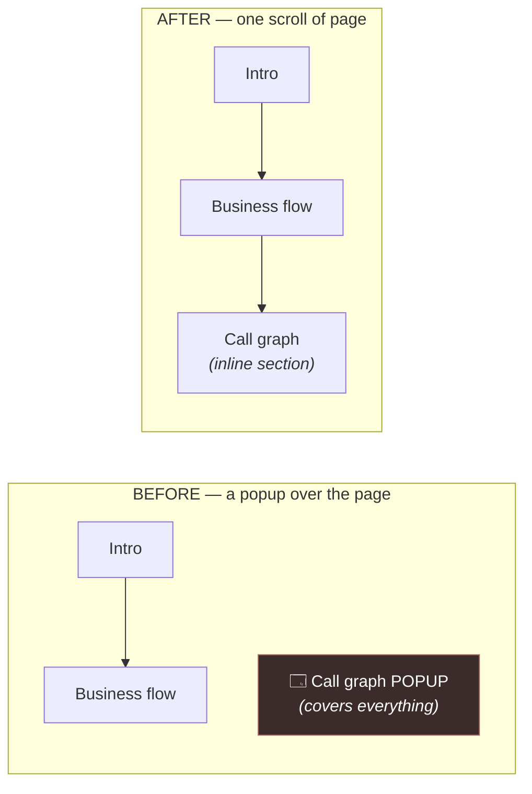
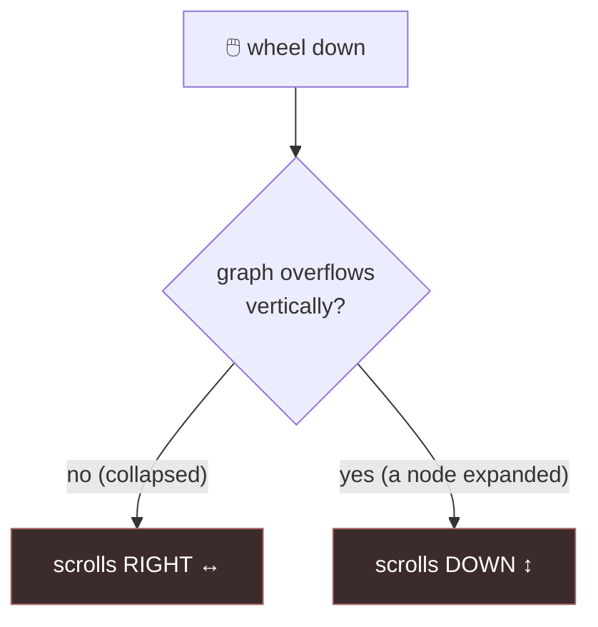
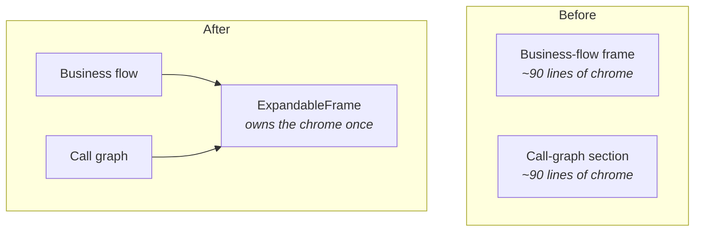
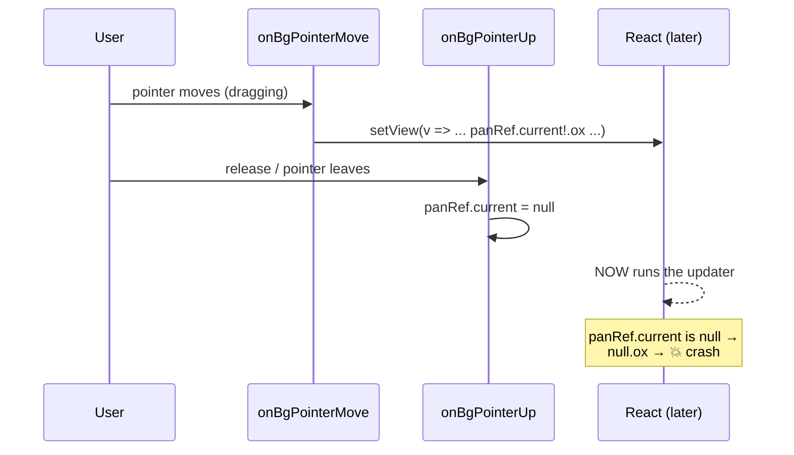

# From popup to page: inlining the call graph (and fixing how it pans)

> **What this explains:** the `feat/journey-inline-callgraph` branch — four related changes that move the call graph from a modal popup onto the page, make panning it predictable, remove a pile of duplicated layout code, and fix a crash you could trigger by dragging the business-flow diagram and letting go.
>
> Diff: `git diff main...HEAD` — 5 files. The line count barely moved; the *shape* of the code changed a lot.

---

## Background

### The wide view — what this screen is (skip if you know it)

Underscore analyzes a C#/Java codebase and produces **journeys**: end-to-end business flows discovered in the code (e.g. "a user places an order"). Each journey is rendered as a **chapter page** with two complementary diagrams:

- **The business flow** — a BPMN diagram: the human-readable "boxes and arrows" story of what the journey does. Rendered by `BpmnCanvas`, which you can pan and zoom.
- **The call graph** — the machine-level truth beneath the story: every function this journey calls, as a tree, with source code available on selection. Rendered by `CallFlowChart` as a big SVG.

Both live inside `ChapterView.tsx`, which is by far the largest file in the diff. It owns the page layout, the top bar, keyboard shortcuts (Esc), and a right-edge **code dock** that opens when you select a function.



> [!NOTE]
> **BPMN** (Business Process Model and Notation) is just a standard visual language for flows — think flowchart with a rulebook. You don't need to know the spec; treat it as "the pretty diagram."

### The narrow view — how the call graph used to appear

Before this branch, the chapter page was a small **state machine** with two states, held in one variable:

```ts
const [view, setView] = useState<"detail" | "flow">(...)
```

- `"detail"` — the page you read: intro, then the business-flow diagram. This is the default.
- `"flow"` — a **modal popup** (`flowPopup()`) that floated *over* the page — a dimmed backdrop with the call graph in a centered dialog (`role="dialog" aria-modal`).

You could even deep-link straight into the popup with `?view=flow`. That sounds trivial but hid a wrinkle worth remembering:

> [!IMPORTANT]
> The app runs under **HashRouter**, so the whole route lives inside the URL hash: `#/journeys/checkout?view=flow`. That means `window.location.search` is *always empty* — the query string is inside the hash, not before it. The old code had to read react-router's hash-aware `location.search` instead, on mount.

So the call graph was a **detour**: click a button, a dialog covers the page, read it, close it, you're back. The business flow and the call graph were two mutually-exclusive surfaces, cross-linked but never visible together.

That is the world this branch rearranges.

---

## Intuition

### Change 1 — stop stacking, start stacking *vertically*

The core idea is a one-word change in how two things relate: from **layered** to **listed**.



Both diagrams now sit on the same page, top to bottom. Nothing is hidden behind a toggle. To keep the call graph usable when it's big, it keeps *one* affordance the business-flow frame already had: an **expand-to-fill-screen** button. That gives us a second boolean, `cgExpanded`, that mirrors the existing `frameExpanded`. The `"detail" | "flow"` state machine — and the deep link that fed it — simply evaporate.

### Change 2 — a scroll gesture that doesn't change its mind

The call graph is a **wide, short** SVG: deep call forests grow sideways. Dropped into a scroll box, it usually overflows *horizontally* but not vertically.

The old code tried to be helpful: it intercepted the mouse wheel and, *when the graph overflowed horizontally but not vertically*, remapped vertical wheel motion into horizontal scrolling. The trouble is that condition — `canX && !canY` — is not stable. Expand one node, the graph grows tall enough to overflow vertically, and the *same wheel gesture* silently switches axis.



To the user, the scroll wheel "breaks" for no reason they took. The fix is to stop being clever: a plain wheel always does the native thing. Horizontal movement comes from three predictable sources instead — **drag-to-pan** (grab the background, the viewport follows your cursor), the **scrollbars**, and the browser-native **Shift+wheel**.

> [!TIP]
> A good litmus test for gesture design: *the same input should always produce the same kind of output.* A remap gated on the current layout fails that test; drag-to-pan passes it.

### Change 3 — two copies become one component

Once the call graph became an inline section with an expand button, it looked *exactly* like the business-flow frame: a dim backdrop when expanded, a bordered card that becomes a fixed-inset overlay, a header strip with a maximize/minimize toggle, and a body area sized to `70vh` when docked in the page or `flex-1` when expanded. Two ~90-line blocks, differing only in what went in the header and body.



`ExpandableFrame` absorbs the shared shell; each caller passes only what differs (`header`, `actions`, `background`, a body).

### Change 4 — the drag-and-release crash (a race in slow motion)

This is the subtle one. The business-flow canvas pans by remembering where the drag started in a ref (`panRef`), then on each pointer move updating the camera with React's *functional* `setView`:

```ts
setView((v) => ({ ...v, x: panRef.current!.ox + (e.clientX - panRef.current!.startX), ... }))
```

Look closely: the arrow function passed to `setView` reads `panRef.current` **inside** the updater. React does not necessarily run that updater immediately — it can defer it to the next render/commit. Meanwhile `onBgPointerUp` (which fires when you release, *especially* when the pointer leaves the canvas) sets `panRef.current = null`.



The error the user saw — *"Cannot read properties of null (reading 'ox')"* — is exactly `null.ox`. The synchronous guard a few lines up (`if (!panRef.current) return`) doesn't help, because it runs *now*, while the crashing code runs *later*.

The fix is a one-liner in spirit: **snapshot the values before handing control to React.** Copy `panRef.current` into a local `p` and destructure the pointer coordinates, then let the updater close over those stable locals. Even if the ref is nulled a millisecond later, `p` still points at the numbers we captured.

> [!WARNING]
> `ref.current` is *live* — it reflects whatever the value is at the moment you read it. A deferred callback (a state updater, a `setTimeout`, a promise `.then`) that reads `ref.current` reads it at call time, not at schedule time. If a ref can be cleared between scheduling and running, capture it into a local first.

---

## Code

Here's the tour, grouped by the four ideas above, plus a fifth housekeeping fix.

### 1. `ChapterView.tsx` — deleting the popup state machine

This file shed the most code. The removals cluster around the `view` variable:

- **The state and its deep link are gone.** `useState<"detail" | "flow">`, the `?view=flow` parsing, and `useLocation` (only used to read the hash-aware query) are all deleted, along with the now-unused `X` (close) icon import.
- **`flowPopup()` is deleted.** The dialog wrapper — backdrop, `role="dialog"`, centered card — no longer exists. Its *contents* (`flowDockLayout()`) survive; they just render inline now.
- **A new inline section appears** below the business flow, driven by a new `const [cgExpanded, setCgExpanded] = useState(false)`.
- **Esc handling** switched branch: where it used to close the popup (`setView("detail")`), it now collapses the expanded call graph (`setCgExpanded(false)`).
- **Code-dock visibility simplified.** `codePaneVisible` went from `!!activeFunctionId && view === "flow"` to just `!!activeFunctionId` — because there's no longer a "flow view" to be in.

The `flowDockLayout()` helper (the call graph plus its resizable code dock) is unchanged in spirit — it still switches between bottom/left/right dock positions using `ResizablePanelGroup`. It just has a new home.

### 2. `CallFlowChart.tsx` — predictable navigation

- **Removed:** the non-passive `wheel` listener and its `useEffect` that remapped vertical wheel to `scrollLeft` when `canX && !canY`.
- **Added:** pointer-based drag-to-pan on the scroll container (`onPanPointerDown/Move/Up/Cancel`), backed by a `panRef` capturing the start position and scroll offsets. It's gated with `if ((e.target as Element).closest("[data-fqn]")) return;` so pressing a *node* still selects/expands it — only the background pans. `setPointerCapture` keeps the drag alive when the cursor leaves the box.
- **Polish:** `el.style.userSelect = "none"` on pan start (cleared on end) stops the text-selection smear across node labels while dragging.

The container itself gained `cursor-grab` and the four pointer handlers:

```tsx
<div
  ref={scrollContainerRef}
  className="min-h-0 flex-1 cursor-grab overflow-auto"
  onPointerDown={onPanPointerDown}
  onPointerMove={onPanPointerMove}
  onPointerUp={endPan}
  onPointerCancel={endPan}
>
```

### 3. `ExpandableFrame.tsx` — the new shared shell

A new ~110-line component. Its contract is small:

| Prop | Meaning |
|---|---|
| `expanded` / `onToggle` | the caller owns the boolean; the frame renders the toggle button |
| `label` | noun for the toggle's title/aria ("flow", "call graph") |
| `background` | section background token |
| `header` / `actions` | left-aligned identity vs. right-aligned buttons (a `flex-1` spacer sits between them) |
| `collapsedClassName` | extra classes for the docked state (e.g. `mt-6`) |
| `sectionRef` | forwarded to the `<section>` — used by the business flow to swallow wheel while expanded |

Both `ChapterView` call sites now render `<ExpandableFrame …>` and pass their differing bits. The business flow passes its validation badge and PNG-export button as `actions`; the call graph passes just a title.

### 4. `BpmnCanvas.tsx` — the crash fix

The whole change is in `onBgPointerMove`:

```diff
- if (!panRef.current) return;
- setView((v) => ({
-   ...v,
-   x: panRef.current!.ox + (e.clientX - panRef.current!.startX),
-   y: panRef.current!.oy + (e.clientY - panRef.current!.startY),
- }));
+ const p = panRef.current;
+ if (!p) return;
+ const { clientX, clientY } = e;
+ setView((v) => ({
+   ...v,
+   x: p.ox + (clientX - p.startX),
+   y: p.oy + (clientY - p.startY),
+ }));
```

Same math, but the updater now closes over `p` and the captured coordinates instead of re-reading the live ref (and the synthetic event) at some later moment.

### 5. `resizable.tsx` — a quiet v4 compatibility fix

`react-resizable-panels` v4 changed how it signals a group's direction. This wrapper was still reading the old signal.

- **v3** exposed `data-panel-group-direction="vertical"`; the wrapper's Tailwind flipped layout off that attribute.
- **v4** exposes `aria-orientation` on the separator instead — and *inverts the sense*: a **horizontal** separator means a **vertically-stacked** group. The old selectors matched nothing, so the layout flip had silently stopped working.

The fix keys the styling off `aria-[orientation=horizontal]`, threads an explicit `orientation` prop through `ResizablePanelGroup`, and applies `flex-col` directly. While there, the handle grew from an un-hittable 1px line into a transparent ~6px grab band with a 1px `::before` line and a proper `col-resize`/`row-resize` cursor.

> [!NOTE]
> This is the kind of bug that hides in a dependency bump: nothing errors, a class just quietly stops applying. Worth calling out because the symptom ("the resize cursor never appears") looks unrelated to a version upgrade.

---

## Quiz

**1. Why did the old wheel-remap in `CallFlowChart` feel like the scroll "broke"?**

<details><summary>A) It only worked with a trackpad, not a mouse.</summary>

❌ The remap actually targeted the plain mouse wheel (trackpads already emit horizontal deltas). The problem wasn't the input device.
</details>

<details><summary>B) The remap was conditional on the graph overflowing horizontally but <i>not</i> vertically, so expanding a node flipped the wheel's axis.</summary>

✅ The gate was `canX && !canY`. Expand a node, the graph gains vertical overflow, and the same wheel gesture stops scrolling horizontally and starts scrolling vertically — with no action from the user to explain the change.
</details>

<details><summary>C) It scrolled the whole page instead of the graph.</summary>

❌ That's the *problem the remap was trying to solve*, not why it was removed. It was removed because its cure was inconsistent.
</details>

---

**2. What is the root cause of the "Cannot read properties of null (reading 'ox')" crash?**

<details><summary>A) `panRef` was never initialized.</summary>

❌ It's initialized to `null` and set on pointer-down. The crash happens after a real drag, not before one.
</details>

<details><summary>B) The `setView` updater read `panRef.current` when it ran, which could be <i>after</i> `onBgPointerUp` had set the ref to `null`.</summary>

✅ React can defer the functional updater past the pointer-up that nulls the ref. Reading `panRef.current!.ox` inside the updater then dereferences `null`. Capturing the ref into a local before calling `setView` fixes it.
</details>

<details><summary>C) Two pointer-move events fired at once and raced on `setView`.</summary>

❌ The race isn't between two moves; it's between a scheduled updater and the pointer-up handler that clears the ref.
</details>

---

**3. Why doesn't the synchronous `if (!panRef.current) return;` guard prevent the crash on its own?**

<details><summary>A) `panRef.current` is always truthy, so the guard never triggers.</summary>

❌ It can absolutely be null — that's the whole point. The guard just runs at the wrong time relative to the crash.
</details>

<details><summary>B) The guard runs when the handler is called, but the crashing dereference runs later inside the deferred updater.</summary>

✅ Timing is everything. The guard checks the ref *now*; the updater reads it *later*. Between those two moments the ref can be nulled. Only snapshotting into a local closes the gap.
</details>

<details><summary>C) React strips guard clauses from event handlers in production builds.</summary>

❌ React does no such thing. The guard executes fine; it's simply not where the danger is.
</details>

---

**4. After this branch, when is the call graph's docked code panel visible?**

<details><summary>A) Only while the call graph is open in its popup view.</summary>

❌ That was the old rule (`view === "flow" && activeFunctionId`). There is no popup view anymore.
</details>

<details><summary>B) Whenever a function is selected (`!!activeFunctionId`).</summary>

✅ With the popup gone, the condition simplified to just having a selected function. Select a node, its source docks alongside the inline graph.
</details>

<details><summary>C) Always — it renders even with nothing selected.</summary>

❌ It still requires a selection; an empty code dock would waste space.
</details>

---

**5. What made extracting `ExpandableFrame` worthwhile, and how do the two callers differ?**

<details><summary>A) It removed a runtime dependency; both callers are now identical.</summary>

❌ No dependency was removed, and the callers are not identical — they pass different headers, actions, backgrounds, and bodies.
</details>

<details><summary>B) The business-flow frame and the new call-graph section shared nearly all their expand/collapse chrome; the frame now owns it once, and callers pass only `header`, `actions`, `background`, and the body.</summary>

✅ The shell (backdrop, section shell, toggle button, `70vh`/`flex-1` sizing) was duplicated ~90 lines twice. `ExpandableFrame` holds it once; each caller supplies only what differs — which is why adding the call graph didn't grow the total line count much.
</details>

<details><summary>C) It was required to make the resizable panels work in v4.</summary>

❌ The v4 fix lives in `resizable.tsx` and is independent of the frame extraction.
</details>

---

*Source of this change: `feat/journey-inline-callgraph` — commits `e4fe920` (inline call graph), `54d4c33` (pan crash fix), `e7232ca` (predictable scroll + ExpandableFrame), `aeea245` (comment trim).*
