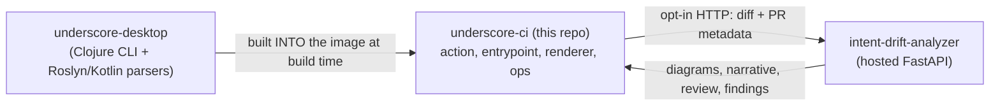

# Architecture — underscore-ci is one corner of three repos

underscore-ci does not stand alone. Knowing which of the three repos owns which concern is the single most useful thing to internalise, because it tells you where a change actually belongs. Scope: the boundaries between the repos and the contracts across them. Non-scope: the internals of the other two — each has its own docs. Audience: anyone about to change analysis behavior, the report, or the AI layer.

## underscore-desktop is the upstream source of the analysis, and is read-only from here

The Clojure/JVM analysis CLI and the language parsers live in a sibling `underscore-desktop` checkout, under `backend/`. **This repo does not contain that code.** [`scripts/build-image.sh`](../../scripts/build-image.sh) reaches into the desktop checkout at image-build time and produces three of the image's four payloads:

- the backend uberjar, via `clojure -T:build uber` in `backend/`;
- the framework-dependent Roslyn CLI, via `dotnet publish backend/tools/roslyn-cli/RoslynCli.csproj`;
- the Kotlin parser JAR, via `./mvnw -DskipTests package` in `backend/tools/kotlin-parser`.

**To change what the analysis computes, you change underscore-desktop**, then rebuild the image here.

## The renderer is a fork of the desktop renderer, not a copy of it

The fourth payload — `report-dist/` plus the single-file template — is built here from `src/` by `pnpm build` and `pnpm build:singlefile`. `src/` began as the desktop app's Electron renderer with Electron stripped out, and has since diverged: the logPhase visual identity, report mode, the repo hub and the portal all live here and nowhere else. **Never re-copy the desktop renderer over `src/`** — port logic changes across selectively. See [the-report-renderer](the-report-renderer.md).

## intent-drift-analyzer is the AI layer, and it is reached from two places

The hosted analyzer is a single FastAPI service that holds the model key and meters spend per tenant. Two independent callers in this system talk to it:

| Caller | What it sends | Gate |
|---|---|---|
| `entrypoint.sh`, directly by `curl` | the PR's three-dot diff, title, description, repo id, PR number → `POST $INTENT_DRIFT_URL/review/general` | `review: 'on'` + `INTENT_DRIFT_TOKEN` |
| the analysis CLI, while it runs | the PR's staged artifacts, for BPMN, overview, summaries, specs, grouping, architecture and findings | `INTENT_DRIFT_TOKEN` + the env flags `entrypoint.sh` exports |

The hosted viewer adds a third, browser-side path: its `/ask` location proxies a report's question to the analyzer's `/bpmn/ask` with a server-injected token. Details: [enrichment-and-privacy](enrichment-and-privacy.md).

The analyzer's own docs are the authority for what happens on the far side of that wire. This repo only needs to know which env vars enable which call and that every one of them is best-effort.

## What this repo owns

| Area | Files | Doc |
|---|---|---|
| CI orchestration | `action.yml`, `entrypoint.sh`, `.github/workflows/underscore.yml` | [entrypoint-runtime](../reference/entrypoint-runtime.md) |
| Image build | `Dockerfile`, `scripts/build-image.sh` | [scripts-and-image](../reference/scripts-and-image.md) |
| Report renderer (the fork) | `src/`, `vite.config.ts` | [the-report-renderer](the-report-renderer.md) |
| Publish / retire | `scripts/publish-report.sh`, `scripts/retire-report.sh` | [scripts-and-image](../reference/scripts-and-image.md) |
| Hosted viewer | `viewer/` | [deployment-viewer-and-app](../reference/deployment-viewer-and-app.md) |
| Onboarding GitHub App | `github-app/` | [deployment-viewer-and-app](../reference/deployment-viewer-and-app.md) |

## `pr-output.json` is the seam where the two codebases meet at runtime

The contract between the desktop-sourced analysis and this repo's renderer is one JSON file, `pr-output.json`, emitted by the CLI (`-o`) and read by the renderer's boot loader. Its raw shape is mirrored in `src/types/analysis.ts` as `RawAnalysisJSON`; if the backend changes that shape, `transformToFrontendFormat` in `src/lib/transform-data/index.ts` is where you reconcile it. Everything else the report shows — specs, findings, PR overview, architecture — arrives inside that same file.

A second, smaller seam now exists on the publish side: `repo-manifest.json`, written by `scripts/publish-report.sh` and typed in `src/types/repo-manifest.ts`. It is produced entirely by this repo.
