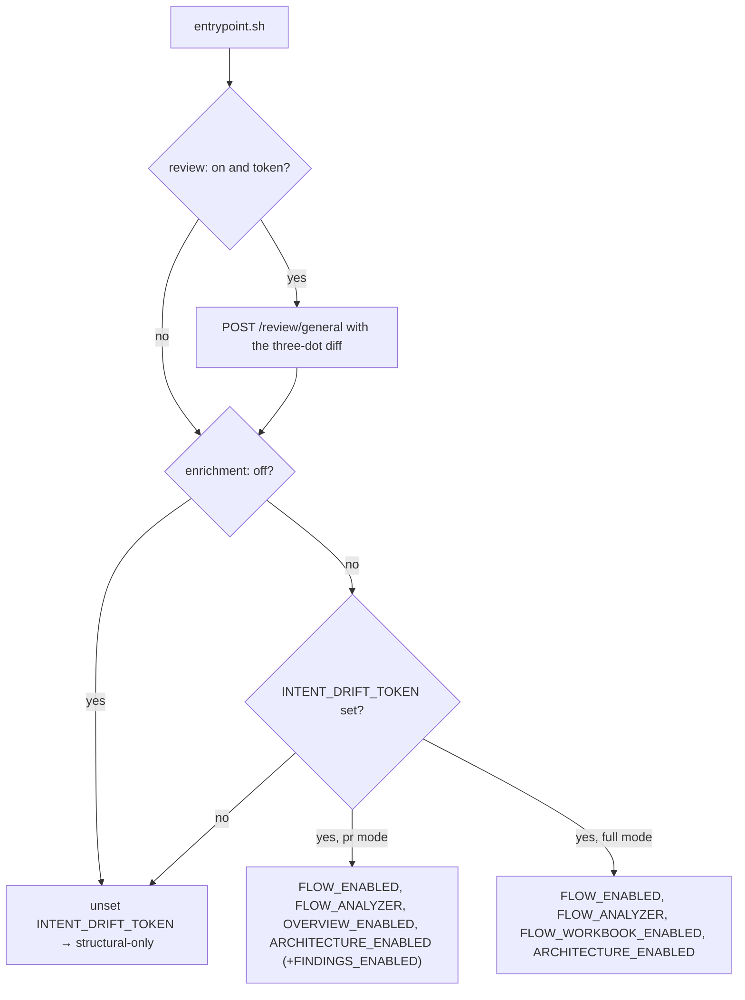

# Enrichment and privacy — what leaves the runner, and when

The design tension in underscore-ci is that **the client's code must not leave their runner unless they explicitly opt in**. This explains the operating modes, exactly what crosses the boundary, and why enrichment can never break a client's pipeline. Scope: the gating and the data flow as implemented in `entrypoint.sh` and `action.yml`. Non-scope: what the analyzer does with what it receives — its own docs cover that. Audience: anyone answering a client's security question, or changing an enrichment gate.

## Two switches, not one: `enrichment` and `review` are independent

`enrichment: off` drops `INTENT_DRIFT_TOKEN` for the analysis step only, which makes the CLI degrade to a structural-only report — one lever that silences every analyzer-side agent at once. The general code review is requested earlier, by `entrypoint.sh` itself, with the token intact, so `enrichment: off` + `review: on` posts a code review and nothing else.

| Surface | Requires | Gate |
|---|---|---|
| Call graph, journeys, PR impact overlay, chapter deep-dives | nothing | always on |
| BPMN business-flow diagrams | `INTENT_DRIFT_URL` + `INTENT_DRIFT_TOKEN` | `enrichment: on` (default) |
| Repository architecture diagram | same | `enrichment: on`, both modes |
| PR overview narrative | same | `enrichment: on`, **pr mode only** |
| Journey summaries / workbook | same | `enrichment: on`, full mode |
| Correctness findings | same | `findings: 'on'`, pr mode |
| General code review (diff only) | same | `review: 'on'`, pr mode |

Structural-only is a deliberate privacy mode, not a degraded fallback: remove one secret and the whole analysis runs on the runner with nothing leaving it.

## The gating is a plain token check, and the flags are per mode

`full` mode deliberately omits `OVERVIEW_ENABLED`: the PR overview is a PR-delta artifact and the analyzer's `/overview` has no whole-repo mode. The optional `BPMN_MAX_JOURNEYS` env var caps BPMN cost in full mode, where a large repo can produce dozens of journeys; `entrypoint.sh` does not re-export it, it is read straight from the container env that `action.yml` forwards.

## Exactly two payloads cross the boundary

**The code review, sent by `entrypoint.sh`.** `git diff BASE...HEAD` — three-dot, no `-U` widening, so the review window matches what GitHub's PR UI treats as the change — plus the PR title, the PR description, the analyzer repo id and the PR number, as one JSON body to `POST $INTENT_DRIFT_URL/review/general` with a bearer token. Diffs over 4,000,000 bytes are dropped client-side rather than sent. The request allows 900 seconds, because it is a synchronous agent session rather than a lookup.

**The analysis artifacts, sent by the CLI.** When the flags above are set, the analysis CLI stages the PR's artifacts with the analyzer — journeys, the source they cover, and the changed method bodies — and reads back diagrams, narrative, summaries and findings. That traffic is the CLI's, not the runner shell's and not the browser's.

Nothing else leaves. In particular `ANTHROPIC_API_KEY` appears nowhere in this repo and is never required in client CI: the model key lives on the analyzer.

There is one further, *browser-side* path that exists only for hosted reports: the viewer's `/ask` location proxies a reader's question to the analyzer's `/bpmn/ask` with a token injected server-side, so the browser never holds one. A downloaded `file://` report has no Ask affordance at all.

## Enrichment can never fail a client's pipeline

This is a hard rule, enforced at three levels:

- **Every analyzer call in `entrypoint.sh` is wrapped.** `set -e` is on, so each fallible step ends in `|| { echo "::warning::…"; return 0; }` — and each precondition logs its own reason, because collapsing them into one silent return once made "no comment appeared" indistinguishable from "never ran". A 503 (agent not configured), a 402 (out of credits), a timeout and an HTTP error each produce a distinct warning on a green check.
- **A trailing slash cannot silently disable everything.** `INTENT_DRIFT_URL` is stripped of trailing slashes and re-exported before use, because `//endpoint` 404s and best-effort handling would have turned that into a quiet warning.
- **Even analysis failure stays green in pr mode.** With the default `fail-on-error: false`, a failed analysis upserts a "failed, see logs" comment and exits 0. `full` mode is the deliberate exception: there is no PR to comment on, so a failure always fails the step.

## Why any of this is gated

Privacy and monetization share the same machinery. We host the analyzer, so tokens and credits bound the spend (the analyzer answers 402 when a tenant's balance runs out, and `entrypoint.sh` reports that as a warning). The analysis image is private and pulled with a per-client token that `action.yml` passes to `docker login`, so image access is grantable and revocable per client, and the pinned tag (`v2`, `v2.x.y`) controls what a client actually runs.
