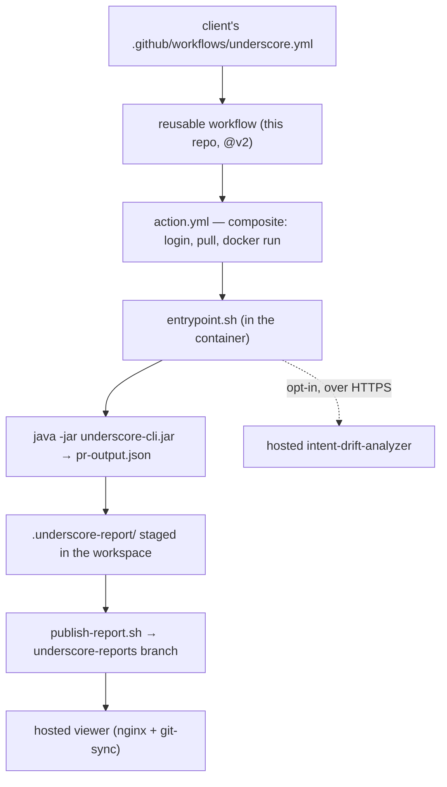

# System overview — a pull request becoming a report

**Read this first.** It narrates the one flow the whole repo serves: a pull request opens, and an interactive HTML report appears. Scope: the orchestration this repo owns — the client's workflow, `action.yml`, `entrypoint.sh`, publishing. Non-scope: what the analysis CLI computes (that code lives in underscore-desktop — see [architecture-three-repos](architecture-three-repos.md)) and what the renderer does with the payload (see [the-report-renderer](the-report-renderer.md)). Audience: anyone changing underscore-ci.

## Analysis runs on the client's runner; we host nothing but the optional extras

underscore-ci is a **GitHub Action plus the static report it publishes**. The analysis executes inside the client's CI runner, in a container we ship. The only thing that leaves the runner is opt-in AI enrichment ([enrichment-and-privacy](enrichment-and-privacy.md)).

## The client integrates with one ~10-line file

The client copies [`examples/underscore.yml`](../../examples/underscore.yml) into their `.github/workflows/`. It triggers on `[pull_request, workflow_dispatch]` and delegates to our reusable workflow at `@v2`, so every improvement we ship reaches them without a change on their side. The onboarding GitHub App commits an equivalent *action-form* caller instead — see [deployment-viewer-and-app](../reference/deployment-viewer-and-app.md).

## The reusable workflow does the checkout and fixes the publishing posture

[`.github/workflows/underscore.yml`](../../.github/workflows/underscore.yml) is `on: workflow_call`. It does two meaningful things: `actions/checkout@v4` with **`fetch-depth: 0`** (the analysis diffs base against head via git worktrees, so it needs full history), then `uses: logPhase/underscore-ci@v2` with `mode: auto` and `publish: branch`. Its job holds `contents: write` + `pull-requests: write` and per-PR concurrency, cancelling in progress only for `pull_request` events.

It forwards a deliberately **narrow** input set: `viewer-url`, `sln`, `lang`, `reports-branch`, `workspace`, `enrichment`, `review`. There is no `image` passthrough and no `findings` input here — a caller who needs those calls the action directly.

## The action is composite because the analysis image is private

[`action.yml`](../../action.yml) is a composite action, deliberately *not* `runs.using: docker`. Hosted runners pull container-action images during "Set up job", before any step can `docker login`, so a private GHCR image would be unpullable (actions/runner#1919). The action therefore performs login, pull and run itself, in four steps:

1. **Pull analysis image** — `docker login ghcr.io` when `ghcr-token` is set, then `docker pull` the `image` input (default `ghcr.io/logphase/underscore-ci:v2`).
2. **Run analysis** (`id: analyze`) — resolves `mode: auto` to `pr` (on `pull_request`) or `full`, derives `INTENT_DRIFT_REPO_ID` (default: the repo name) and `INTENT_DRIFT_WORKSPACE` (default: the `workspace` input, else the org), then `docker run`s the image with the mounts a container action would have received.
3. **Publish report to reports branch** — only when `publish == 'branch'` *and* the analyze step produced a `report-file`; runs [`scripts/publish-report.sh`](../../scripts/publish-report.sh) on the runner.
4. **Retire stale report** — only when `publish == 'branch'` and the analyze step reported `skipped == 'true'`; runs [`scripts/retire-report.sh`](../../scripts/retire-report.sh).

Every input and output is tabulated in [action-inputs-outputs](../reference/action-inputs-outputs.md).

## Inside the container, the order of operations is itself a design decision

[`entrypoint.sh`](../../entrypoint.sh) runs under `set -euo pipefail`. Exhaustive detail lives in [entrypoint-runtime](../reference/entrypoint-runtime.md); the shape:

- **PR metadata comes from the event payload, never the API.** In `pr` mode `jq` reads `base.sha`, `head.sha`, `.number`, `.title`, `.head.ref` from `GITHUB_EVENT_PATH`. The PR body is always written to `/tmp/underscore/pr-description.md` and exported as `PR_DESCRIPTION_FILE` when non-empty.
- **The analyzer URL is de-slashed first.** A trailing slash would make every call `//endpoint`, which the analyzer 404s — and because enrichment is best-effort, that surfaces as warnings on a green check. One stray character would otherwise silently disable every LLM feature.
- **The general code review runs before anything can skip.** `post_general_review` is called *above* the infra-only skip and above the analysis, because it needs only the checkout and the parsed payload. So the review still posts on a PR that changes no source files and on a PR whose structural analysis fails. Exactly one call site, so an agent run can never be billed twice.
- **Source-less PRs exit clean.** A three-dot (merge-base) `git diff --name-only BASE...HEAD -- <lang glob>` decides whether any source files changed. If none did: output `skipped=true`, one step-summary line, `exit 0` — no comment, no red check.
- **Enrichment posture is one token away.** `enrichment: off` unsets `INTENT_DRIFT_TOKEN` for the analysis step; with a token present the script exports `FLOW_ENABLED`, `FLOW_ANALYZER`, `ARCHITECTURE_ENABLED` and mode-specific flags for the CLI.
- **The analysis.** `pr` mode runs the CLI's `pr` verb with `--base`/`--head`; `full` mode runs `analyze` over the whole checkout. Both emit **`pr-output.json`** — that filename is the renderer's boot contract.
- **Staging.** `report-dist/` (baked into the image) plus `pr-output.json`, `manifest.json` and the un-injected `underscore-hub.html` shell are copied into `.underscore-report/`. In `artifact` delivery, `inject-report-data.mjs` inlines the JSON into one `underscore-report.html`.
- **Comment and findings.** In `pr` mode one marker-keyed comment (`<!-- underscore-pr-report -->`) is upserted with links only — no counts, no analysis content on the PR itself. If the payload carries findings, a PR review with inline comments follows. Both are best-effort: a `gh` failure after a successful analysis never reddens the check.

## Two different agent products reach the PR by two different paths

The **general code review** is requested by `entrypoint.sh` itself: a `curl` POST of the three-dot diff to `$INTENT_DRIFT_URL/review/general`, rendered with `jq` into its own comment keyed by `<!-- underscore-code-review -->`. It is opt-in (`review: 'on'`), capped at a 4 MB diff, and needs no analysis output at all.

Everything else — BPMN flows, PR overview, journey knowledge, specs, grouping, architecture, correctness findings — is requested by the **analysis CLI** while it runs, gated by the env flags `entrypoint.sh` exports, and arrives baked into `pr-output.json`. The two paths are independent, which is why `enrichment: off` + `review: on` posts a code review and nothing else.

## Publishing turns the reports branch into a self-bootstrapping site

[`scripts/publish-report.sh`](../../scripts/publish-report.sh) commits the staged report to the orphan `underscore-reports` branch — `reports/pr-<N>/` per PR (refreshed on every push), or `reports/<UTC-stamp>-run-<n>/` plus a stable `latest/` for full runs. It maintains `runs.json` (upsert-by-PR in pr mode, append in full mode) and `repo-manifest.json` (the hub's data: global architecture + specs + PR index), and writes the report bundle's un-injected shell as the root `index.html` so the landing page is the SPA in hub mode. With `reports-repo` + `reports-deploy-key` set, all of that lands in a dedicated reports repository over SSH instead of a branch of the code repo.

The hosted [`viewer/`](../../viewer) — nginx plus a git-sync sidecar — serves that branch, so a new commit appears without a redeploy. Reviewers can equally open the report as a downloaded artifact (`file://`) or from a GitHub Pages `pr-<n>/` subpath; all three work because the renderer uses HashRouter and relative asset paths.

## What runs where — the model that prevents most mistakes

| Concern | Where it runs | Why it matters |
|---|---|---|
| Call-graph analysis, diff, journeys | client's CI runner, in our image | the client's code stays on the runner |
| The analysis *logic* (CLI + Roslyn/Kotlin parsers) | source lives in underscore-desktop | not editable here |
| The report renderer | built here from `src/`, baked into the image | a fork of the desktop renderer |
| AI enrichment and the code review | our hosted analyzer | the only thing that leaves the runner, opt-in |
| Report hosting | our viewer, or an artifact, or Pages | pure static; no analysis, no IP |

The common misconception is that the analysis code lives in this repo. It does not: this repo orchestrates the analysis and renders its output.
