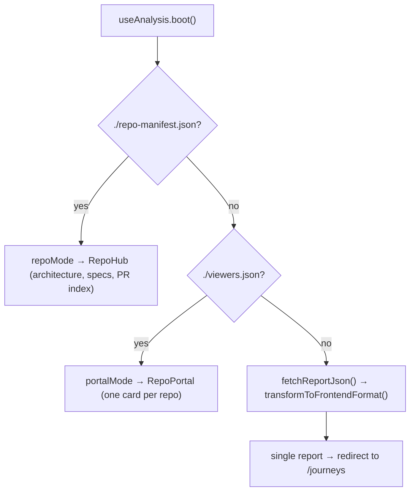

# The report renderer — one static app, three boot shapes

`src/` is a React 19 + Vite + Zustand single-page app whose job is to render a static analysis report with no backend. This explains how it boots, the constraints that shape every architectural choice, and the one live feature that survived the strip-down. Scope: why the renderer is built this way. Non-scope: the exhaustive route/store/type listing — that is [renderer-architecture](../reference/renderer-architecture.md) — and how to run it, which is [develop-the-renderer](../how-to/develop-the-renderer.md). Audience: anyone changing what the report looks like or how it loads.

## It is a fork of the desktop renderer, and re-copying would destroy it

The renderer began as a verbatim copy of underscore-desktop's Electron renderer with Electron stripped out. It has since diverged far enough that it must be treated as a fork: the logPhase visual identity lives in `src/index.css` (deep-indigo canvas, phase-violet accent, a reserved cyan "signal" — its own comment says so), as do report mode, the repo hub, the portal and the payload-gated surfaces. **Never re-copy the desktop renderer over `src/`**; port logic changes in selectively.

Being a fork also means ported artifacts linger. `src/types/bpmn-ask.ts` still exports `BPMN_ASK_IPC = "analyzer:bpmn-ask"`, an Electron IPC channel name with zero importers, and `src/components/journeys/CallFlowChart.tsx` — the hand-rolled SVG call-graph renderer — is now unreferenced dead code: `ChapterView.tsx` renders `CallFlowGraph.tsx` (React Flow) instead, with the layout shared through `src/lib/callgraph/tree-layout.ts`. Expect to find more of these; check for importers before you trust a file.

## Three constraints shape everything

1. **It runs from `file://`.** A reviewer downloads the artifact and double-clicks; there is no server. Hence **HashRouter** (deep links live in the fragment, so nothing needs rewriting), a relative Vite `base: "./"`, and fonts bundled through `@fontsource` so they load offline.
2. **It also runs from a hosted subpath.** The viewer serves it under `…/reports/pr-<n>/` and Pages under `pr-<n>/`. The same relative-base and hash-routing choices cover both — there is no base-path coupling anywhere.
3. **There is no live backend, with exactly one exception.** Everything the report shows is baked into the payload at CI time. The exception is Ask, below.

## Boot is manifest-first: the same bundle is a report, a repo hub, or a portal

One bundle serves three surfaces, chosen by what is sitting next to it on the server. `useAnalysis.boot()` probes in order and takes the first hit:

`EntryLoader` (`src/pages/entry.tsx`) is the `/` route that renders whichever of the three the store selected, with a 12-second watchdog (`STUCK_MS`) that surfaces a reload button rather than spinning forever. This is why `scripts/publish-report.sh` writes `repo-manifest.json` and copies the *un-injected* bundle to the branch root as `index.html`: at the root the probe finds the manifest and boots the hub, while the same bundle under `reports/pr-<n>/` finds only its own inlined payload and boots the report.

### The inline-tag-versus-fetch fallback

`fetchReportJson()` reads the `<script id="underscore-report-data">` tag first. In the single-file artifact, `scripts/inject-report-data.mjs` has already replaced the `__UNDERSCORE_REPORT_DATA__` marker with the real JSON, so the text starts with `{` and parses. In dev and in the multi-file Pages build the marker is still raw, so the loader falls back to `fetch('./pr-output.json')`. That two-branch check *is* the marker contract with the injection script — change one side and you must change the other.

> **Gotcha:** the real transform is `src/lib/transform-data/index.ts`. `src/data/transform-data.ts` is an unrelated constants file (color palettes, validation sets) that happens to share the name.

## Surfaces appear only when the payload carries them

The report's routes are `/canvas`, `/architecture`, `/journeys`, `/journeys/:chapterSlug`, `/specs` and `/findings`, all nested under a persistent `SessionShell` rail. Specs and findings are **payload-gated**: each page reads its slice off `transformedData` and redirects to `/journeys` when absent, so a structural-only report simply has no such page rather than an empty one. Any new AI-fed surface should follow that pattern.

## Ask is the only network feature, and only on a hosted viewer

`askEndpointHref()` (`src/lib/ask-endpoint.ts`) returns `null` unless the page is served over http(s) *and* its path matches `…/reports/<dir>/` or `…/latest/<dir>/`; only then does it derive `POST <root>/ask` — the viewer's relay, which injects analyzer auth server-side so the browser never holds a token. `AskPanel` (mounted from `ChapterView`) renders nothing when that returns `null`, so a downloaded artifact never offers a dead affordance. Requests abort after 180 seconds.

This is the desktop project's KEEPOUTS rule honored rather than worked around: **hide server-backed features, never mock them**. Everything else the report shows — specs, findings, PR overview, journey knowledge, architecture — is baked into the payload at CI time and merely gated on its presence.
